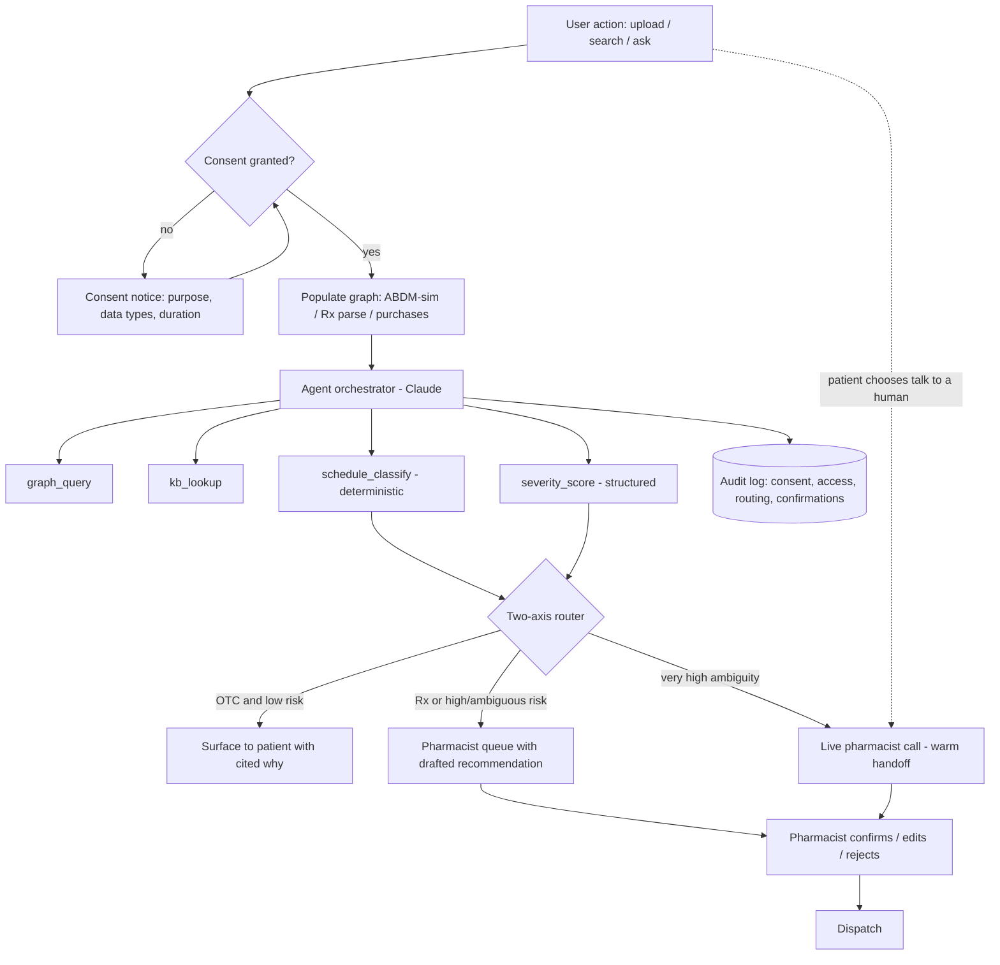

# AI Pharmacist Layer — Requirements & Architecture

Reference platform: **Tata 1mg** (India). Exercise: take-home for Unify Apps.
This document is the single source of truth for the build. It doubles as the Claude Code project context.

---

## 1. Problem, goal, and metric

**Business problem.** People readily adopt grocery and food-delivery apps but under-adopt pharmacy/medicine-delivery apps. We want to lift new-user adoption and repeat purchases by working an *agentic pharmacist* into an existing pharmacy app — ambiently, not as another chatbot.

**Personas (patient-direct).**
- P1 — Digital-native busy professional. Will reuse an experience that works the first time. The real test of the experience.
- P2 — Older adult, buys more medicines, has mobility concerns, digitally plugged in. Refill/maintenance-heavy. Accessibility is core to serving them.

**North Star metric.** % of new users who complete a **second medicine purchase within 30 days**. It only moves if onboarding landed (adoption) *and* the experience was good enough to return (repeat). Report it segmented by persona (P2's second purchase is partly refill-driven; P1 is the true experience signal).

**Key leading indicator.** Time-to-value — time to first medicine purchase after first agent interaction.

**Guardrail metrics.**
- Autonomous gated-action count = **0** (the agent never executes a legally gated action without a human).
- Interaction-miss rate (flagged interactions ÷ true interactions in seeded eval set).
- Human-handoff resolution time (agent-drafted → pharmacist-confirmed).
- Consent grant rate and revocation rate.
- Accessible-task-completion rate (screen reader + large text can complete refill/search/upload).

---

## 2. Design principles

1. **Ambient, not a destination.** Intelligence surfaces inside surfaces the user already touches (search, prescription upload, product page, cart). No floating AI button, no "start a conversation" moment. The single conversational affordance is contextual, summoned from the point of need (the existing product-page "Ask" box), never global.
2. **The LLM orchestrates and explains; it is never the source of medical truth.** Drug facts, interactions, contraindications, schedules, and generic equivalence come from a curated knowledge base. A hallucinated interaction is a safety event, so facts are retrieved, never generated. The model composes, reasons over the patient graph, and explains.
3. **Explainability by construction.** Every agent conclusion is a *path* across the patient graph and knowledge base, rendered as a traceable chain with cited sources. Trust is earned by showing the work, the way a pharmacist would.
4. **Every action is risk-classified and routed.** Two classification axes — legal and clinical — decide whether the agent auto-acts or hands to a human, and the patient can always choose to reach a human directly. The agent assesses; it never decides to act on gated items.
5. **Accessibility is a core requirement, not an NFR footnote** — driven by P2. WCAG 2.1 AA, plus voice-into-search as an accessibility modality (distinct from a voice chatbot).

---

## 3. Scope

**Build (three surfaces + the human paths):**
- S1 — **Prescription reconciliation** (HITL hero). Agent reads an uploaded prescription, drafts the pharmacist's selections (add medicines, best coupon, earliest delivery) *plus* a graph reconciliation pass (interactions, duplications, cheaper generics). Pharmacist reviews a prepared recommendation instead of building it in 4 minutes.
- S2 — **Condition/symptom search fix** (safety hero). Agent-composed, graph-aware results that redirect unsafe substitutions (e.g. "diabetes medicine" → homeopathic drops presented as a substitute for prescribed treatment).
- S3 — **Graph-aware product Q&A** (explainability hero). Upgrade of 1mg's existing product-scoped "Health Assistant" to reason over the patient's conditions, allergies, and current meds, with cited answers.
- Pharmacist queue view — where gated/flagged items land with the agent's drafted recommendation.
- Live pharmacist call handoff — patient-initiated from any surface, or system-escalated on high ambiguity; a warm handoff carrying the agent's draft + a graph summary.

**Document as extension, do not build:** caregiver / manage-on-behalf-of profiles; voice-into-search; living "My medicines" dashboard; adherence tracking over time; ABDM live integration.

**Narrative.** 1mg already has the islands — Health Assistant, Health Records, pharmacist verification, generics, salt-level drug info — but they don't reason over each other. This layer is the connective tissue across them, working over a patient graph.

---

## 3.1 UI and visual design (match Tata 1mg)

The front end should read as Tata 1mg at a glance — use the uploaded screenshots as the design guide. Not pixel-exact; the high-level layout, components, and colour should match so the agent feels native to the app.

Visual language:
- Primary colour: 1mg coral-red (~#F5634A) for primary buttons and accents. White card surfaces on a near-white page. Generous rounded corners (12–16px) on cards and buttons.
- Black pill buttons for secondary actions (e.g. "Categories"). Outlined-coral "Add to cart" buttons.
- Top bar: location selector pill ("Home 1102, Tower 11…"), profile icon, cart icon.
- Category tab strip under the top bar: For You · Pharmacy · Labs · Consults · Insurance · Vaccines, with small illustrative icons; Pharmacy is the working tab.
- Search field ("Search paracetamol") paired with a black "Categories" pill.

Screens to reproduce at high level (from the screenshots):
- Home / Pharmacy tab — search, promo banner, category grid, "Delivery in a flash".
- Search results + product detail — Uses / How it works / Side effects / Expert advice; "Available medicines" list (brand, manufacturer, price range, variants); FAQs.
- Product page agent entry — the "Ask your question" chip strip + "Ask anything" field + the "Health records" bar; opens the Health Assistant.
- Health Assistant — blue user bubbles, plain assistant text, suggested-question chips, thumbs up/down. This is the surface we upgrade to be graph-aware.
- Prescription flow — Upload prescriptions → "How would you like us to process your request?" (Order everything / Request pharmacist to call) → assigned-pharmacist card → "Verifying your prescription".
- Cart / checkout — delivery time, coupons/offers, item rows with quantity steppers, bill summary, address, UPI/GooglePay.
- New agentic screens we add (consent, reconciliation card, pharmacist queue, call handoff) inherit the same visual language.

---

## 4. Functional requirements

Graph & knowledge
- FR-G1 The system maintains a patient graph (nodes: conditions, allergies, current/previous meds, prescriptions, purchases, lab results; edges: the relationships between them).
- FR-G2 The system maintains a separate drug knowledge base (drug facts, interactions, contraindications, therapeutic class, salt/generic equivalence, drug schedule H/H1/X/OTC).
- FR-G3 The agent reasons by overlaying the knowledge base onto the patient graph; it never writes medical facts into the patient graph from model output.
- FR-G4 Graph population sources, in priority order: (1) ABDM consent-import [simulated], (2) prescription upload parse, (3) in-app purchase history, (4) manual entry.

Consent
- FR-C1 Before any agent access to health records, the user grants purpose-scoped, data-type-granular (meds / labs / prescriptions), time-bound, revocable consent.
- FR-C2 The system shows a standalone, plain-language consent notice stating the specific purpose.
- FR-C3 The user can view and revoke consent at any time; revocation stops agent access and triggers erasure per retention policy.
- FR-C4 Every consent grant, access, and revocation is written to an audit log.
- FR-C5 [Simulated] On consent, the system fetches ABDM-style records and populates the graph.

Routing / permissions
- FR-R1 Every actionable request is classified on two axes: legal tier (OTC / H / H1 / X) and clinical-risk severity.
- FR-R2 Legal-tier classification is deterministic (schedule lookup), never model-decided.
- FR-R3 Rx items (H/H1/X) always route to a registered pharmacist for verification before dispatch.
- FR-R4 Any item — including OTC — routes to the pharmacist queue if clinical severity crosses the threshold.
- FR-R5 Low-severity clinical findings surface to the patient with "worth checking with your pharmacist" framing and one-tap handoff.
- FR-R6 The agent drafts, but never executes, any action in a gated cell of the permissions matrix (§7).
- FR-R7 The patient can invoke a live pharmacist call from any surface at any time (standing affordance), independent of classification; the agent's draft + a graph summary accompany the handoff (warm handoff). The system also escalates to a call on very high ambiguity.

Surfaces
- FR-S1 (Rx) Agent parses an uploaded prescription into structured items and drafts the three pharmacist selections + a reconciliation card (interaction / duplication / generic-cost / contraindication).
- FR-S2 (Rx) The pharmacist queue shows the draft; the pharmacist confirms, edits, or rejects each line; nothing dispatches without confirmation for Rx items.
- FR-S3 (Search) Condition/symptom queries return agent-composed results ranked for safety and relevance over the patient graph, not ad rank; unsafe substitutions are flagged and redirected.
- FR-S4 (Q&A) Product questions are answered using the knowledge base overlaid on the patient graph, with each claim citing its source; contraindications against the user's own conditions/allergies are surfaced.
- FR-S5 Every agent claim exposes a "why?" affordance showing the reasoning path and sources.

Explainability
- FR-X1 For any flag or recommendation, the system can render the graph path and the knowledge-base sources that produced it.

---

## 5. Non-functional requirements

- NFR-A1 Accessibility: WCAG 2.1 AA across the three surfaces and the consent + upload flows (contrast, focus order, labels, target size, screen-reader names).
- NFR-A2 Voice-into-search available as an input modality on the existing search field [in scope if time allows; else documented].
- NFR-UI1 The front end matches Tata 1mg's high-level look and layout (per §3.1 and the uploaded screenshots); new agentic surfaces inherit the same visual language.
- NFR-S1 Safety: no medical fact originates from the model; all facts trace to the knowledge base. Interaction/contraindication logic is deterministic given the graph + KB.
- NFR-S2 The agent cannot execute any gated action; enforced in code, not prompt.
- NFR-P1 Privacy: designed to DPDP Rules 2025 — purpose limitation, data minimisation, storage limitation, consent withdrawal, erasure, audit logging. Consent model maps to the ABDM consent-manager pattern.
- NFR-P2 Children's data (<18) requires verifiable parental consent [documented edge, not built].
- NFR-L1 Latency: agent responses on S3 stream; S1 reconciliation completes within the existing "~4 minute" pharmacist-processing window.
- NFR-E1 Explainability: every recommendation is traceable to a graph path + sources.
- NFR-R1 Auditability: consent, access, routing decisions, and pharmacist confirmations are logged.
- NFR-D1 Graceful degradation: all surfaces function with an empty or partial graph (cold-start).

---

## 6. Patient graph + knowledge base

Two structures that meet:
- **Patient graph** — this person's world; the agent's memory of who they are.
- **Knowledge base** — general medical truth, patient-independent; retrieved, never generated.

The value is in the edges: interaction = edge between two med nodes; duplication = two prescriptions from two doctors into the same therapeutic class; contraindication = edge between a med and a condition/allergy; adherence = purchase-timestamp gaps vs. expected duration; cheaper generic = alternative nodes sharing a salt.

**Prototype implementation.** Seeded, typed node/edge data in a structured store, queried by the agent via tools. Presented *as* a graph because the reasoning is relational. Production choice: a graph database (e.g. Neo4j), justified by relationship-traversal at scale — documented, not stood up for the prototype.

**Cold-start.** Handled by the ranked population sources (FR-G4). ABDM import populates the graph on day one where records exist; otherwise the graph seeds from prescription upload and first purchase and compounds with use. The graph is the flywheel: the second visit is better because the graph now knows the user — which is the North Star mechanism.

**Seeded demo patients (in /data).** Two patients exercise the design:
- `patient_graph.json` — Lakshmi Rao (P2, 68): an existing user with a populated graph (polypharmacy, two doctors, a refill gap, and a pending prescription). Drives S1 reconciliation (interaction + duplication + generic cost), the S2 "diabetes medicine" trap, and the S3 OTC-but-flagged Ibuprofen case.
- `patient_graph_p1.json` — Ananya Menon (P1, 32): a brand-new user whose in-app graph is empty (`pre_consent`). Her ABDM records (`abdm_available`: hypothyroidism, on levothyroxine) unlock on consent and populate the graph — the cold-start → ABDM-consent → graph-populates arc on screen. Once populated, a routine OTC calcium-supplement purchase fires a timing-interaction flag (calcium blocks levothyroxine absorption).

The graph loader starts P1 from her empty `pre_consent` state and merges `abdm_available` into the working graph only after consent is granted; P2 loads as already populated.

---

## 7. Routing / permission engine

Two classification axes decide how an item is handled, and there are **three routing outcomes**. An item routes to a human if it trips either axis — and the patient can always choose the live-pharmacist outcome themselves, regardless of classification.

**Axis 1 — Legal (deterministic — schedule lookup, never model-decided).**
- OTC / non-scheduled → no pharmacist gate; auto-flow.
- Schedule H → pharmacist verifies valid prescription.
- Schedule H1 → + stricter sale-register handling.
- Schedule X → + duplicate prescription, licensee retains a copy.

**Axis 2 — Clinical (agent-assessed, human-confirmed).**
- Agent emits a *structured severity score*; a deterministic threshold (not the model's free choice) decides auto-surface vs. route-to-human.
- High / ambiguous → pharmacist queue, even for OTC.
- Low → surface to patient with pharmacist-handoff framing.

**Three routing outcomes.**
1. **Auto-surface to patient** — with cited "why" (OTC + low clinical risk).
2. **Async pharmacist queue** — drafted recommendation for review (Rx, or high/ambiguous clinical risk).
3. **Live pharmacist call** — the patient talks to a real pharmacist. Reached two ways: (a) patient-initiated — a standing affordance on every surface (the "talk to a real person" escape hatch, important for P2 and for trust); (b) system-escalated — when ambiguity is high or the patient declines the agent's suggestion. Either way it is a *warm handoff*: the agent's reconciliation draft and a graph summary travel to the pharmacist so the call starts informed.

Grounded in the existing app: 1mg's prescription flow already offers "Request pharmacist to call." Outcome 3 generalises that to every surface.

Note on framing: the two *axes* are what the system scores every item on (legal, clinical). The three *outcomes* are where an item can land. The live call is a routing outcome that is always user-reachable, not a third scoring axis — this keeps the model clean and defensible.

**Permissions matrix.**

| Action | AI | Pharmacist | Doctor |
|---|---|---|---|
| Explain medication | Yes | Yes | Yes |
| Remind patient | Yes | Yes | Yes |
| Detect possible interaction | Yes | Yes | Yes |
| Reconcile medication list | Yes | Yes | Yes |
| Identify refill gap | Yes | Yes | Yes |
| Draft pharmacist recommendation | Yes | Yes | Yes |
| Recommend generic alternative | Yes | Yes | Yes |
| Approve substitution | No | Depends on legal/Rx context | Yes |
| Change prescription | No | No / limited | Yes |
| Prescribe | No | No | Yes |
| Dispense prescription drugs | No | Licensed pharmacist | No |

**Legal basis (design-level, not legal advice).** India has no finalized dedicated e-pharmacy law; the Drugs & Cosmetics Act/Rules and Pharmacy Act 1948 apply. Rx drugs (H/H1/X) require a valid prescription and dispensing by a registered pharmacist; every Rx order is reviewed and approved by a registered pharmacist before dispensing. OTC has no per-order pharmacist gate. This is exactly why the legal axis maps to drug schedule.

---

## 8. Agent architecture

- **Model.** Claude (Anthropic) — strong structured tool-use and source-cited reasoning, which is the explainability requirement.
- **Orchestration.** A transparent, deterministic router + a constrained LLM reasoning step. No heavy agent framework — the logic (router, reasoning call, guardrail) stays visible and demonstrable.
- **Tools the agent calls.**
  - `graph_query` — read the patient graph.
  - `kb_lookup` — retrieve drug facts / interactions / contraindications / generics.
  - `schedule_classify` — deterministic OTC/H/H1/X lookup.
  - `severity_score` — structured clinical-risk assessment.
  - `draft_recommendation` — produce a pharmacist-facing draft (never executes).
- **Guardrails in code, not prompt.** Gated actions are unreachable by the agent; the router enforces the two-axis decision; facts must carry a KB source or they are not shown.

---

## 9. System architecture (data flow)

Components: client (three surfaces + consent + pharmacist queue + call handoff), agent orchestrator (API route calling Claude with the tools), patient-graph store (seeded), knowledge-base store (seeded), deterministic router + schedule classifier, audit log. Everything mocked except the live Claude reasoning.

---

## 10. Metrics instrumentation (prototype)

The North Star (30-day repeat) cannot be shown live, so it is a design artifact. The prototype emits the underlying events so the metric tree is demonstrable: `first_agent_interaction`, `first_purchase`, `agent_flag_shown`, `flag_accepted`, `handoff_created`, `handoff_resolved`, `pharmacist_call_requested`, `consent_granted`, `consent_revoked`, `accessible_task_completed`, and — enforced-zero — `autonomous_gated_action`.

---

## 11. Build plan (Claude Code)

Stack: Next.js/React + Tailwind (1mg-like shell), a server route calling the Claude API for reasoning, seeded JSON for the patient graph and knowledge base, a deterministic router module in plain code.

Real vs mocked: **real** = Claude reasoning, the router/guardrails, the graph overlay logic, the three surfaces, the consent + pharmacist queue + call-handoff screens. **Mocked** = ABDM fetch, patient data, drug knowledge base, pharmacist identity, the actual phone call, payments/delivery.

Phased steps:
1. Scaffold app + 1mg-like shell (home, search, product, upload, cart) per §3.1.
2. Seed patient graph + knowledge base; build `graph_query` / `kb_lookup`.
3. Deterministic `schedule_classify` + two-axis router + permissions guard + the three outcomes.
4. S1 prescription reconciliation + pharmacist queue + call-handoff (HITL hero).
5. S2 condition-search fix (safety hero).
6. S3 graph-aware Q&A with cited "why?" (explainability hero).
7. Consent flow (DPDP/ABDM-sim) + audit log + revocation.
8. Accessibility pass (WCAG 2.1 AA) + event instrumentation.

---

## 12. Decision rationale (defend line by line)

| # | Decision | Why | Trade-off accepted |
|---|---|---|---|
| 1 | Build in Claude Code | Full control over agent wiring, guardrails, accessibility; Unify cares how the agent is built | Slower to a polished skin than Lovable |
| 2 | Claude as the LLM | Best structured tool-use + source-cited reasoning = explainability | Model choice barely matters functionally for a prototype |
| 3 | Build S1/S2/S3 only | Covers both personas + all three required qualities + HITL; completable | Other surfaces documented, not shown |
| 4 | Deterministic router, no framework | Keeps router/reasoning/guardrail visible and demonstrable | Less "impressive framework" signalling |
| 5 | LLM never source of medical truth | A hallucinated fact is a safety event; enables citations | Requires a curated KB |
| 6 | Two-axis hybrid routing | Legal must be deterministic; clinical nuance suits the model but not the act | More engineering than a single classifier |
| 7 | Graph modeled, structured store impl. | Traversal is the reasoning; graph DB is production-fragile for a take-home | Not a "real" graph DB in the demo |
| 8 | Metrics as design + event scaffold | 30-day retention can't be shown live | No live retention number |
| 9 | ABDM-consent as primary graph seed | Solves day-one cold-start where records exist | Coverage partial; still need degradation paths |
| 10 | Third outcome: live pharmacist call | Trust + accessibility (P2); mirrors 1mg's "request call"; ultimate fallback and escalation path | Requires a pharmacist-staffing model in production |
| 11 | Front end matches 1mg | Agent must feel native to an existing journey; recognisable to reviewers | Time spent on shell fidelity |

---

## 13. Risks & mitigations

- Scope creep ("absorb the Health Assistant" tempts rebuilding half of 1mg) → hold at three surfaces; everything else documented.
- Agent perceived as giving medical advice → voice stays "explain + draft for pharmacist," never "decide/prescribe"; clinical proactivity gated behind pharmacist review; live-call escape hatch for anything the patient wants a human on.
- Cold-start vs. adoption → ranked graph-population sources; every surface works with an empty graph.
- Regulatory drift → design to current D&C/Pharmacy Act + DPDP Rules 2025; note that specifics need counsel for production.
- Empty ABDM / declined consent → graceful degradation to Rx-upload and first-purchase seeding.
